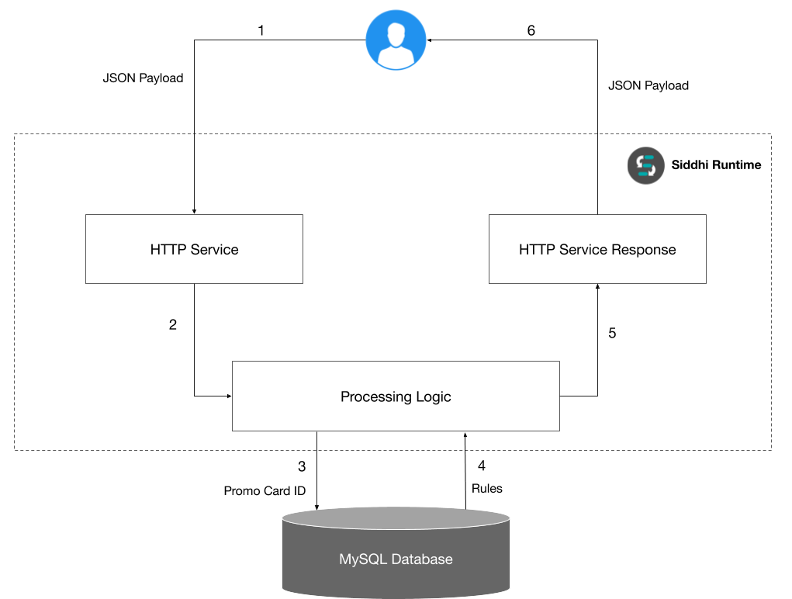
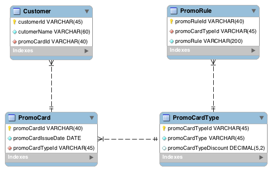
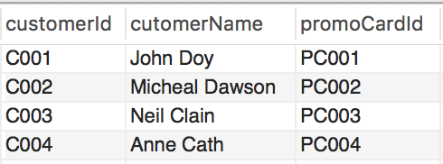

Static Rule Processing via Predefined and Database Based Rules
===========================================================

In this guide, we are going to explore how to process static rules stored in a database and make a decision according to those stored rules.

## Scenario - Static Rule Processing

After completing this scenario, you will be able to implement a system capable of making decisions according to a set of static rules. The static rules will be stored in a relational database(MySQL). You can dynamically change the rules in the database according to your business requirements without touching the deployed system. All the dynamic values need for each rule can be templated and pump into the rule at runtime.

## What You'll Build

The implementation of this use case explains using the functional requirements of the Combo supermart. Combo supermart is a supermarket that resides in our town. This Combo supermarket gives a loyalty card for their frequent customers. Each loyalty card has a type. These card types are Platinum, Gold, and Silver, etc. In each season management of the combo supermart planning to give discounts for each loyalty card. The percentage of the discount will change according to the type of loyalty card. Moreover, each loyalty card will select to have these discounts if that loyalty card fulfills several requirements. Those requirements are stored in a database as rules. These rules can be changed from time to time. Since combo supermart has to handle thousands of customer transaction per day in this season they cannot calculate these discounts in a manual process. Hence they planning to build an automatic system to calculate these discounts.

As shown in the following diagram the business process has to execute using six steps.

1. A user sends an HTTP request with a JSON payload that contained an ID of a promo card and the amount of the transaction.
1. That JSON payload will consume by the HTTP service. Then parse the mapped values to the processing logic of the Siddhi query.
1. Initially, processing logic inputs the promo card ID to the MySQL database.
1. And retrieves all the rules relevant to the given promo card type.
1. After that process these rules and send output to the HTTP service response.
1. The HTTP service response will send back another JSON payload which indicating, whether this user allowed to have a discount or not. If this user allowed to have a discount then what is the percentage of the discount.



## Prerequisites

### Mandatory Requirements

1. Siddhi tooling [VM/Local distribution](https://siddhi.io/en/v5.1/download/)
1. One of the [Siddhi runner distributions](https://siddhi.io/en/v5.1/download/)
    1. VM/Local Runtime
    1. Docker Image
    1. K8S Operator (commands are given in Kubernetes deployment section)
1. [MySQL database](https://www.mysql.com/)
1. [Java 8](https://www.oracle.com/java/technologies/jdk8-downloads.html) or higher

### Requirements needed to deploy Siddhi in Docker/Kubernetes

1. [Docker](https://docs.docker.com/install/)
1. Kubernetes cluster
    1. [Minikube](https://github.com/kubernetes/minikube#installation)
    1. [Google Kubernetes Engine(GKE)](https://console.cloud.google.com)
    1. [Docker for Mac](https://docs.docker.com/docker-for-mac/install/)
1. Refer to [this documentation about Configuring a Google Kubernetes Engine (GKE) Cluster](https://github.com/siddhi-io/siddhi-operator/blob/master/docs/gke-setup.md) to deploy Siddhi apps in GKE.

## Implementation

First of all, we assume that the Combo supermart has a MySQL database that contained the all promo card and user details. The following ER diagram describes the schema of the database.



Now, you have to start the Siddhi tooling editor before implementing the Siddhi app. Siddhi tooling editor is an IDE that supports to implement Siddhi apps.

1. First, you can download the Siddhi tooling pack as a zip file from [here](https://siddhi.io/en/v5.1/download/) and extract it.
1. After creating the above database we need to have a mechanism to connect this database to Siddhi runtime. To do that you have to update the Siddhi tooling configuration file. Siddhi tooling configuration file is `<TOOLING_HOME>/conf/tooling/deployment.yaml`. You have to add the following YAML block under the dataSources entry in the deployment.yaml. The following YAML block contained all the details that need to connect to the database. For example, database username, password, and URL, etc.

    ```yaml
    - name: COMBO_SUPERMART_DB
      description: The datasource used for lending process of the Combo supermarket
      jndiConfig:
        name: jdbc/ComboSuperMart
      definition:
        type: RDBMS
        configuration:
          jdbcUrl: 'jdbc:mysql://127.0.0.1:3306/ComboSuperMart'
          username: siddhi_user
          password: siddhiio
          driverClassName: com.mysql.jdbc.Driver
          maxPoolSize: 10
          idleTimeout: 60000
          connectionTestQuery: SELECT 1
          validationTimeout: 30000
          isAutoCommit: false
    ```

1. In order to connect to a MySQL server Siddhi tooling needs the MySQL connector JAR. You can download the MySQL connector JAR from [here](https://dev.mysql.com/downloads/connector/j/5.1.html) and copy that JAR into `<TOOLING_HOME>/jars` directory.
1. Start the following binary file. Using this link http://localhost:9390/editor now you can access the Siddhi tooling editor from your web browser.
    1. For Linux/Mac: `<TOOLING_HOME>/bin/tooling.sh`
    1. For Windows: `<TOOLING_HOME>/bin/tooling.bat`
1. Select `File -> New` option, then you could either use the source view or design view to write/build the Siddhi Application. You can find the Siddhi Application bellow, that implements the requirements mentioned above.

!!! Note "Siddhi Query Guide"
    The execution steps and the logic of the Siddhi query described as comments in the following Siddhi app. Therefore here we are not going to explain in detail here. For more details about Siddhi queries please refer [Siddhi query guide](https://siddhi.io/en/v5.1/docs/query-guide/).

```sql

@App:name("ComboSuperMartPromoProcess")
@App:description("The promotion selection process of Combo super mart.")


/*
Purpose:
    The combo supermart has multiple promotion cards that given to their loyal users. For a particular season combo supermart plan to give discounts for each card. These discounts will change according to the card type and several rules. So, the combo supermart needed an automatic system to retrieve the discounts for a given card. To do that we implement this Siddhi app which interacts with a MySQL database and executes their functionalities. All card details and rules were stored in a MySQL database. All the rules for a particular card were in the templated format. Therefore all rules executed dynamically and give the final result.

Input:
        HTTP POST with JSON payload {
        "event": {
            "promoCardId": "PC001",
            "amount": 20000
          }
        }
       
Output:
    {
    "event": {
        "messageId": "1817d06b-22ae-438e-990d-42fedcb50607",
        "discountAmount": 15.0,
        "discountApplied": true
    }
}

*/
-- HTTP source
@source(
    type='http-service',
    source.id='adder',
    receiver.url='http://0.0.0.0:8088/comboSuperMart/promo',
    basic.auth.enabled='',
    @map(type='json', @attributes(messageId='trp:messageId', promoCardId='$.event.promoCardId', amount='$.event.amount'))
)
define stream InputTransactionStream(messageId string, promoCardId string, amount long);

-- RDBMS data stores
@Store(type="rdbms", datasource="COMBO_SUPERMART_DB")
define table Customer(customerId string, promoCardId string);
@Store(type="rdbms", datasource="COMBO_SUPERMART_DB")
define table PromoCard(promoCardId string, promoCardTypeId string, promoCardIssueDate string);
@Store(type="rdbms", datasource="COMBO_SUPERMART_DB")
define table PromoRule(promoRuleId string, promoCardTypeId string, promoRule string);
@Store(type="rdbms", datasource="COMBO_SUPERMART_DB")
define table PromoCardType(promoCardTypeId string, promoCardTypeDiscount double);

-- Output stream
@sink(type='http-service-response', source.id='adder',
      message.id='{{messageId}}', @map(type = 'json'))
define stream ResultStream (messageId string, discountAmount double, discountApplied bool);

-- Find and execute rules
@info(name='get-promocard-type')
from InputTransactionStream#window.length(1) join PromoCard on InputTransactionStream.promoCardId==PromoCard.promoCardId
select InputTransactionStream.messageId, InputTransactionStream.promoCardId, PromoCard.promoCardTypeId, PromoCard.promoCardIssueDate, InputTransactionStream.amount
insert into GetPromoCardTypeStream;

@info(name='get-promocard-type-details')
from GetPromoCardTypeStream#window.length(1) join PromoCardType on GetPromoCardTypeStream.promoCardTypeId==PromoCardType.promoCardTypeId
select GetPromoCardTypeStream.messageId, GetPromoCardTypeStream.promoCardId, GetPromoCardTypeStream.promoCardTypeId, GetPromoCardTypeStream.amount, PromoCardType.promoCardTypeDiscount, GetPromoCardTypeStream.promoCardIssueDate
insert into GetPromoCardTypeDetailsStream;

@info(name='get-promocard-rules')
from GetPromoCardTypeDetailsStream#window.length(1) right outer join PromoRule on GetPromoCardTypeDetailsStream.promoCardTypeId==PromoRule.promoCardTypeId
select GetPromoCardTypeDetailsStream.messageId, GetPromoCardTypeDetailsStream.promoCardId, GetPromoCardTypeDetailsStream.promoCardTypeId, GetPromoCardTypeDetailsStream.amount, GetPromoCardTypeDetailsStream.promoCardTypeDiscount, PromoRule.promoRuleId, PromoRule.promoRule, GetPromoCardTypeDetailsStream.promoCardIssueDate
insert into RuleStream;

@info(name='execute-promocard-rules')
from RuleStream#window.length(1)
select RuleStream.messageId, RuleStream.promoCardTypeDiscount, js:eval(str:fillTemplate(RuleStream.promoRule, map:create("amount", RuleStream.amount, "cardPeriod", time:dateDiff(time:currentDate(), RuleStream.promoCardIssueDate, 'yyyy-MM-dd', 'yyyy-MM-dd'))), 'bool') as result
insert into RuleReslutsStream;

-- Output results
@info(name='filter-true-rules')
from RuleReslutsStream[result == true]#window.batch()
select RuleReslutsStream.messageId, RuleReslutsStream.promoCardTypeDiscount, count(result) as result
insert into TrueResultStream;

@info(name='get-all-results')
from RuleReslutsStream#window.batch()
select RuleReslutsStream.messageId, RuleReslutsStream.promoCardTypeDiscount, count(result) as result
insert into AllResultStream;

@info(name='discout-reply-stream')
from AllResultStream#window.length(1) unidirectional join  TrueResultStream#window.length(1) on TrueResultStream.result==AllResultStream.result
select AllResultStream.messageId, AllResultStream.promoCardTypeDiscount as discountAmount, true as discountApplied
insert into ResultStream;

@info(name='filter-true-rules-and-reply')
from RuleReslutsStream[result == false]#window.batch()
select RuleReslutsStream.messageId, 0.00 as discountAmount, false as discountApplied
insert into ResultStream;
```

The following flow diagram depicts the design view of the above Siddhi app.


## Testing

Let’s run and test the above Siddhi app in your local machine. If you completed the implementation process correctly you will be able to start your Siddhi application without any error.

Before you run the application your database should have sample data to be processed. The following images show the sample data tables that we are using for this guide.

### Customer Table



### Promo Card Table


### Promo Card Rule Table


### Promo Card Type Table


The above Siddhi app will start an HTTP service in 8088 port. Therefore, you can send a request to that service using the following CURL command.

```sh
curl -X POST \
  http://0.0.0.0:8088/comboSuperMart/promo \
  -H 'Accept: */*' \
  -H 'Content-Type: application/json' \
  -H 'Host: 0.0.0.0:8088' \
  -d '{
  "event": {
    "promoCardId": "PC001",
    "amount": 10000
  }
}'
```

This request will response back the following JSON.

```json
{
    "event": {
        "messageId": "8f38faea-9dbd-4387-b807-b9f170db20dd",
        "discountAmount": 0.0,
        "discountApplied": false
    }
}
```

## Deployment

### Deploy on VM/ Bare Metal

1. First you have to setup MySQL as described earlier. Refer [this](https://www.mysql.com/) link to setup MySQL.
1. Download the [Siddhi runner distribution pack from here](https://siddhi.io/en/v5.1/download/) and unzip it.
1. Add following YAML block to the `<RUNNER_HOME>/conf/runner/deployment.yaml`.

    ```yaml
    - name: COMBO_SUPERMART_DB
      description: The datasource used for lending process of the Combo supermarket
      jndiConfig:
        name: jdbc/ComboSuperMart
      definition:
        type: RDBMS
        configuration:
          jdbcUrl: 'jdbc:mysql://127.0.0.1:3306/ComboSuperMart'
          username: siddhi_user
          password: siddhiio
          driverClassName: com.mysql.jdbc.Driver
          maxPoolSize: 10
          idleTimeout: 60000
          connectionTestQuery: SELECT 1
          validationTimeout: 30000
          isAutoCommit: false
    ```
1. Download the MySQL connector JAR from [here](https://dev.mysql.com/downloads/connector/j/5.1.html) and copy that JAR into `<RUNNER_HOME>/jars` directory.
1. Copy your Siddhi file into `<RUNNER_HOME>/wso2/runner/deployment/siddhi-files`
1. Start the following binary file. Using this link http://localhost:9390/editor now you can access the Siddhi tooling editor from your web browser.
    1. For Linux/Mac: `<RUNNER_HOME>/bin/runner.sh`
    1. For Windows: `<RUNNER_HOME>/bin/runner.bat`

Execute the following CURL command.

```sh
curl -X POST \
  http://0.0.0.0:8088/comboSuperMart/promo \
  -H 'Accept: */*' \
  -H 'Content-Type: application/json' \
  -H 'Host: 0.0.0.0:8088' \
  -d '{
  "event": {
    "promoCardId": "PC001",
    "amount": 10000
  }
}'
```

It will results the following JSON.

```json
{
    "event": {
        "messageId": "8f38faea-9dbd-4387-b807-b9f170db20dd",
        "discountAmount": 0.0,
        "discountApplied": false
    }
}
```

### Deploy on Docker

#### Prerequisite

[Install Docker](https://docs.docker.com/install/) into your machine.

#### Siddhi Docker Configurations

In the tooling editor itself, you can export your Siddhi app into a runnable docker artifact. You can go to `Export->For Docker` and it will give to a zip file that contained the following files.

```sh
├── Dockerfile
├── configurations.yaml
├── jars
│   └── mysql-connector.jar
└── siddhi-files
    └── ComboSuperMartPromoProcess.siddhi
```

You also need to set up a MySQL docker container and connect it into the Siddhi docker runtime. You can do it very easily from writing a docker composer file like below.

```yaml
version: "3"
services:
    backend:
        container_name: combosupermart-promo
        user: 802:802
        build:
          context: .
          dockerfile: ./Dockerfile
        ports:
            - "8088:8088"
        links:
            - mysqldb
        networks:
            - default
        restart: on-failure

    mysqldb:
        image: 'mysql:5.7'
        container_name: combosupermart-db
        environment:
            MYSQL_USER: siddhi_user
            MYSQL_PASSWORD: siddhiio
            MYSQL_ROOT_PASSWORD: siddhiio
        ports:
            - "3304:3306"
        networks:
            - default
        restart: on-failure
```

First, you have to build the docker composer.

```sh
$ docker-compose build
```

Now you have to start the MySQL container.

```sh
$ docker-compose up -d mysqldb
```

Now you can connect to the MySQL server using the following configurations.

1. Host: 0.0.0.0
1. Port: 3304
1. Root user: root
1. Root password: siddhiio
1. Custom user: siddhiio
1. Custom user password: siddhiio

Then you can create the database schema in that MySQL container. After that, you can start the Siddhi runtime using the following command.

```sh
$ docker-compose up -d backend
```

To check the deployments up and running, send the following CURL request.

```sh
curl -X POST \
  http://0.0.0.0:8088/comboSuperMart/promo \
  -H 'Accept: */*' \
  -H 'Content-Type: application/json' \
  -H 'Host: 0.0.0.0:8088' \
  -d '{
  "event": {
    "promoCardId": "PC001",
    "amount": 20000
  }
}'
```

It will results the following JSON.

```json
{
    "event": {
        "messageId": "285703c1-866a-4a88-8e1f-e75543e18373",
        "discountAmount": 15.0,
        "discountApplied": true
    }
}
```

### Deploy on Kubernetes

#### Prerequisites

1. Kubernetes cluster
    1. [Minikube](https://github.com/kubernetes/minikube#installation)
    1. [Google Kubernetes Engine(GKE)](https://console.cloud.google.com)
    1. [Docker for Mac](https://docs.docker.com/docker-for-mac/install/)
1. [Install HELM](https://helm.sh/docs/using_helm/#installing-helm)

#### Siddhi Kubernetes Configurations

In the tooling editor itself, you can export your Siddhi app into a runnable Kubernetes artifact. You can go to `Export->For Kubernetes` and it will give to a zip file that contained the following files.

```sh
├── Dockerfile
├── configurations.yaml
├── jars
│   └── mysql-connector.jar
├── siddhi-files
│   └── ComboSuperMartPromoProcess.siddhi.siddhi
└── siddhi-process.yaml
```

First, you need to install the Siddhi Kubernetes operator. To install Siddhi operator please refer to [this documentation](https://siddhi.io/en/v5.1/docs/siddhi-as-a-kubernetes-microservice/#install-siddhi-operator).

Now you have to set up MySQL in your Kubernetes cluster. To do that use the following helm command.

```sh
$ helm install --name mysql-db --set mysqlRootPassword=siddhiio,mysqlUser=siddhi_user,mysqlPassword=siddhiio,mysqlDatabase=ComboSuperMart stable/mysql
```

Then, you can set a port forwarding to the MySQL service which allows you to connect from the Host

```sh
$ kubectl port-forward svc/mysql-db 3307:3306
```

Now you can access the MySQL cluster externally. Accessing MySQL cluster externally you can create ComboSuperMart database and the database schema. Using jdbc:mysql://mysql-db:3306/ComboSuperMart URL you can access the database.

!!! Note "Database URL for Kubernetes"
    When you changing the `deployment.yaml` configuration of the data source in the Kubernetes export process, you have to specify this URL in the configuration as below.

```yaml
   - name: COMBO_SUPERMART_DB
     description: The datasource used for lending process of the Combo supermarket
     jndiConfig:
       name: jdbc/ComboSuperMart
     definition:
       type: RDBMS
       configuration:
         jdbcUrl: jdbc:mysql://mysql-db:3306/ComboSuperMart
         username: siddhi_user
         password: siddhiio
         driverClassName: com.mysql.jdbc.Driver
         maxPoolSize: 10
         idleTimeout: 60000
         connectionTestQuery: SELECT 1
         validationTimeout: 30000
         isAutoCommit: false
```

Siddhi operator will automatically set up the external access to any HTTP service in a Siddhi app. To set up that external access Siddhi operator by default uses ingress NGINX. Set up the NGINX controller in your Kubernetes cluster as described in [this document](https://kubernetes.github.io/ingress-nginx/deploy/).

Hereafter, deploy the Kubernetes YAML file using the following command.

```sh
$ kubectl apply -f siddhi-process.yaml
```

The ingress created by Siddhi operator will use the hostname as siddhi. Therefore you have to update your /etc/host file with siddhi hostname along with the external IP of ingress.

!!! Note "External IP of Ingress"
    For minikube the ingress external IP is minikube IP and in docker, for Mac, the external IP is 0.0.0.0. For more details about Siddhi, ingress setup refer to [this documentation](https://siddhi.io/en/v5.1/docs/siddhi-as-a-kubernetes-microservice/).

Now you can send HTTP requests to deployed the Siddhi app in the Kubernetes cluster using following CURL command.

```sh
curl -X POST \
  http://siddhi/combo-super-mart-0/8088/comboSuperMart/promo \
  -H 'Accept: */*' \
  -H 'Accept-Encoding: gzip, deflate' \
  -H 'Content-Type: application/json' \
  -H 'Host: siddhi' \
  -d '{
  "event": {
    "promoCardId": "PC001",
    "amount": 20000
  }
}'
```

It will results the following JSON.

```json
{
    "event": {
        "messageId": "285703c1-866a-4a88-8e1f-e75543e18374",
        "discountAmount": 15.0,
        "discountApplied": true
    }
}
```
