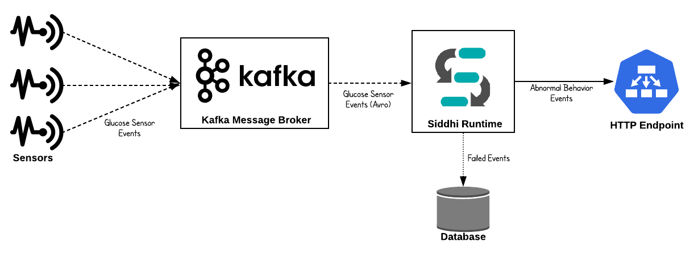
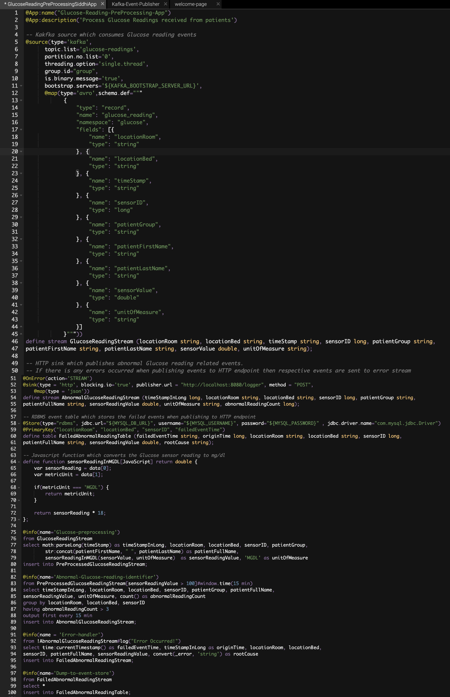
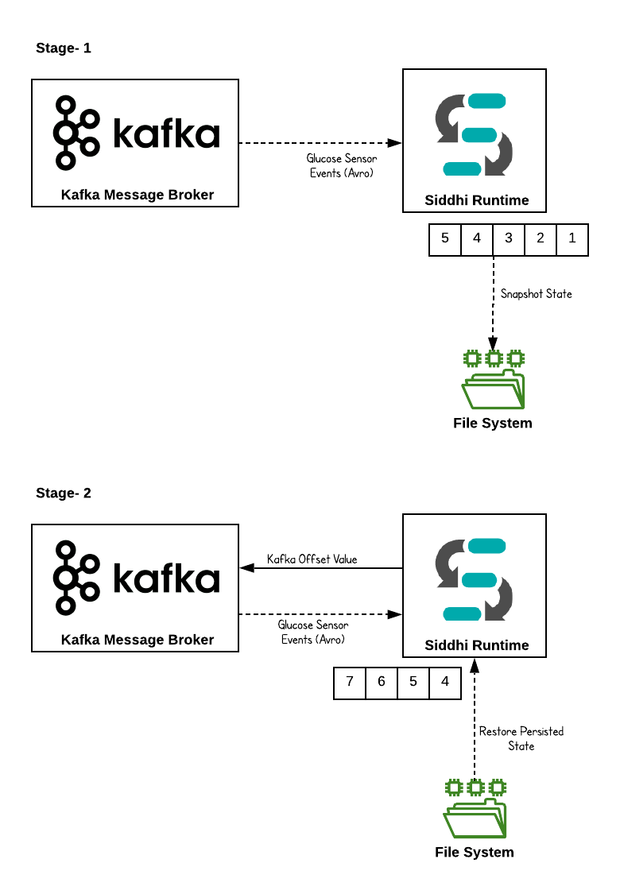
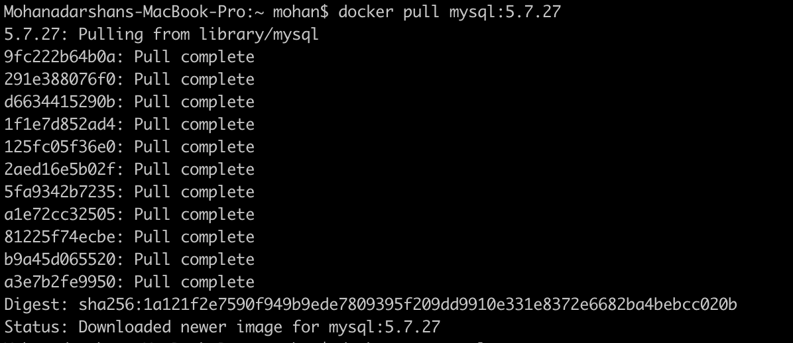
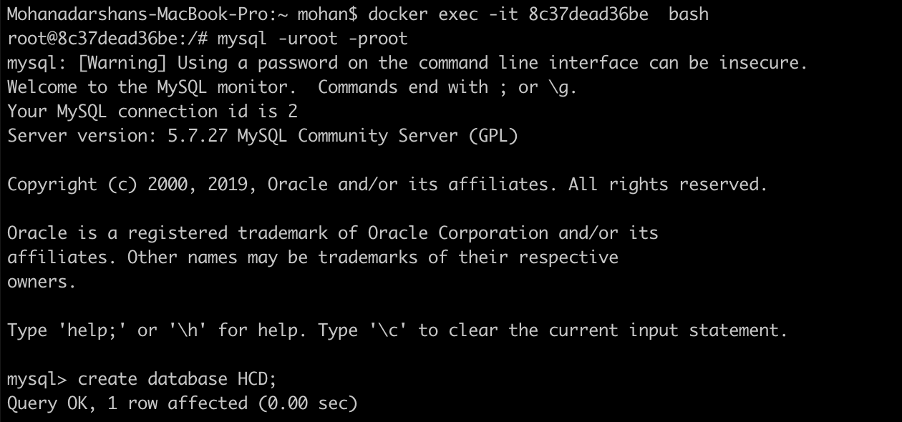
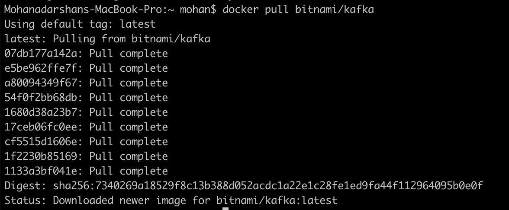
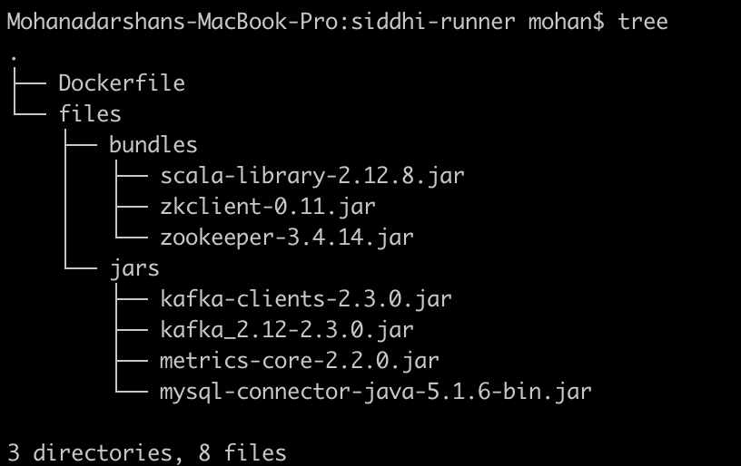
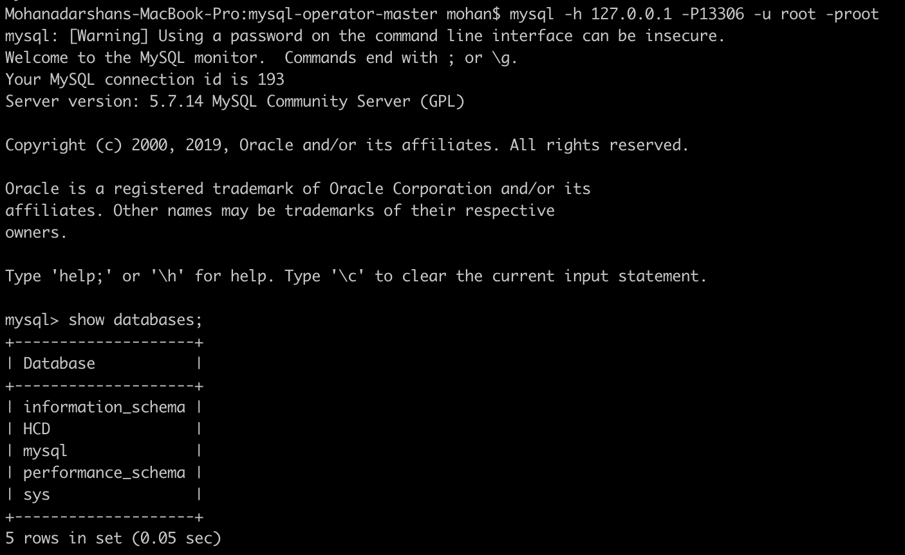
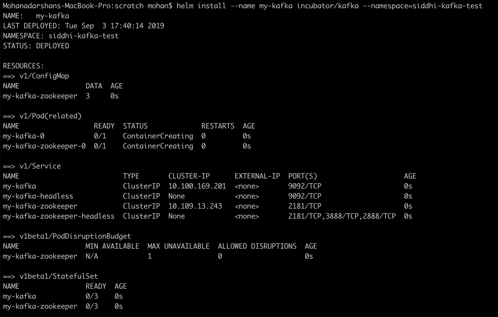
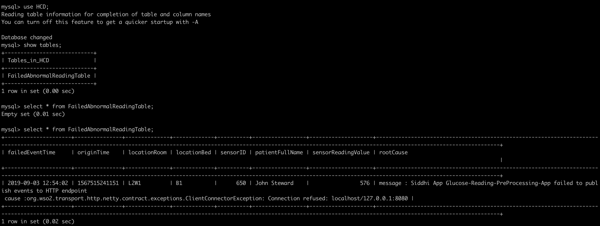

Data Preprocessing, Fault Tolerance, and Error Handling
=========================================================

In this guide, we are going to understand some interesting topics around streaming data integration; they are data preprocessing, fault tolerance and error handling. To understand these capabilities, we are going to consider a health care use case.

## Scenario - Processing Health Care Events (Glucose readings from sensors)
In this scenario, Glucose reading events are received from sensors that mounted on patients. These events are received to the Stream Processing engine, get preprocessed, unrelated attributes are removed and send them to another processing layer to process if there are any abnormal behavior observed.

The following sections are available in this guide.

* [What you'll build](#what-youll-build)
* [Prerequisites](#prerequisites)
* [Implementation](#implementation)
* [Testing](#testing)
* [Deployment & Output](#deployment)

## What you'll build

By following this guide, you will understand the capabilities of Siddhi streaming engine related to data preprocessing, fault tolerance and error handling. To understand better, let’s consider a real-world use case in the health care sector. Let’s jump into the use case directly.

Let’s consider a hospital (or healthcare institution) which primarily provide treatment to diabetic patients. Then, as you are aware it is important to keep close monitoring about the Glucose level of the patients and act accordingly. Then, there is a sensor mounted to each patient to track the Glucose level of the patients. These Glucose reading events are pushed to the central data collection hub, then it pushes those events to Kafka message broker to allow respective interested parties(systems) to consume those events for further processing. These events are published as Avro type messages to Kafka then the Siddhi Stream processing engine consume those events from Kafka message broker, perform some preprocessing, identify abnormal events and push them to an HTTP endpoint. In this complete flow, reliable data processing is a mandatory requirement and cannot lose any events due to failures then there should be proper error handling and fault tolerance features are activated and in place to avoid it. 



Now, let’s understand how this could be implemented in Siddhi engine.

## Prerequisites
Below are the prerequisites that should be considered to implement the above use case.

### Mandatory Requirements
* [Siddhi tooling VM/Local distribution](https://siddhi.io/en/v5.1/download/)
* One of the [Siddhi runner distributions](https://siddhi.io/en/v5.1/download/) 
    - VM/Local Runtime
    - Docker Image
    - K8S Operator (commands are given in deployment section)
* [Kafka Distribution](https://kafka.apache.org)
* [MySQL Database](https://www.mysql.com)
* Java 8 or higher

### Requirements needed to deploy Siddhi in Docker/Kubernetes

* [Docker](https://docs.docker.com/engine/installation/)
* [Minikube](https://github.com/kubernetes/minikube#installation) or [Google Kubernetes Engine(GKE) Cluster](https://console.cloud.google.com/) or [Docker for Mac](https://docs.docker.com/docker-for-mac/install/)


## Implementation

* Events are consumed by Siddhi engine from Kafka message broker. These events are AVRO type.
* Siddhi performs preprocessing for received events and checks for abnormal events.
* If there are any abnormal Glucose reading found then it is forwarded to another processing layer through HTTP.
* To cater to reliable event messaging, necessary fault tolerance and error handling mechanisms are enabled in Siddhi Stream Processor.

### Implement Streaming Queries

1. Start the Siddhi [tooling](https://siddhi.io/en/v5.0/docs/tooling/) runtime and go to the editor UI in http://localhost:9390/editor 

    Follow below steps to start the Siddhi tooling runtime.
    * Extract the downloaded zip and navigate to <TOOLING_HOME>/bin. (TOOLING_HOME refers to the extracted folder) 
    * Issue the following command in the command prompt (Windows) / terminal (Linux/Mac)
        ````
        For Windows: tooling.bat
        For Linux/Mac: ./tooling.sh
        ````

2. Select File -> New option, then you could either use the source view or design view to write/build the Siddhi Application. You can find the Siddhi Application bellow, that implements the requirements mentioned above.

3. Let’s write (develop) the Siddhi Application, as given below.

4. Once the Siddhi app is created, you can use the Event Simulator option in the editor to simulate events to streams and perform developer testing.


````sql
@App:name("Glucose-Reading-PreProcessing-App")
@App:description('Process Glucose Readings received from patients')

-- Kakfka source which consumes Glucose reading events
@source(type='kafka',
      topic.list='glucose-readings',
      partition.no.list='0',
      threading.option='single.thread',
      group.id="group",
      is.binary.message='true',
      bootstrap.servers='${KAFKA_BOOTSTRAP_SERVER_URL}',
      @map(type='avro',schema.def="""
            {
	            "type": "record",
	            "name": "glucose_reading",
	            "namespace": "glucose",
	            "fields": [{
		            "name": "locationRoom",
		            "type": "string"
	            }, {
		            "name": "locationBed",
		            "type": "string"
		        }, {
		            "name": "timeStamp",
		            "type": "string"
		        }, {
		            "name": "sensorID",
		            "type": "long"
		        }, {
		            "name": "patientGroup",
		            "type": "string"
		        }, {
		            "name": "patientFirstName",
		            "type": "string"
		        }, {
		            "name": "patientLastName",
		            "type": "string"
		        }, {
		            "name": "sensorValue",
		            "type": "double"  
		        }, {
		            "name": "unitOfMeasure",
		            "type": "string" 
    	        }]
            }"""))
define stream GlucoseReadingStream (locationRoom string, locationBed string, timeStamp string, sensorID long, patientGroup string, 
patientFirstName string, patientLastName string, sensorValue double, unitOfMeasure string);

-- HTTP sink which publishes abnormal Glucose reading related events. 
-- If there is any errors occurred when publishing events to HTTP endpoint then respective events are sent to error stream
@OnError(action='STREAM')
@sink(type = 'http', blocking.io='true', publisher.url = "http://localhost:8080/logger", method = "POST", 
	@map(type = 'json'))
define stream AbnormalGlucoseReadingStream (timeStampInLong long, locationRoom string, locationBed string, sensorID long, patientGroup string, 
patientFullName string, sensorReadingValue double, unitOfMeasure string, abnormalReadingCount long);

-- RDBMS event table which stores the failed events when publishing to HTTP endpoint
@Store(type="rdbms", jdbc.url="${MYSQL_DB_URL}", username="${MYSQL_USERNAME}", password="${MYSQL_PASSWORD}" , jdbc.driver.name="com.mysql.jdbc.Driver")
@PrimaryKey("locationRoom", "locationBed", "sensorID", "failedEventTime")
define table FailedAbnormalReadingTable (failedEventTime string, originTime long, locationRoom string, locationBed string, sensorID long,
patientFullName string, sensorReadingValue double, rootCause string);

-- Javascript function which converts the Glucose sensor reading to mg/dl
define function sensorReadingInMGDL[JavaScript] return double {
    var sensorReading = data[0];
    var metricUnit = data[1];
 
    if(metricUnit === 'MGDL') {
        return metricUnit;
    }
    
    return sensorReading * 18;
};

@info(name='Glucose-preprocessing') 
from GlucoseReadingStream
select math:parseLong(timeStamp) as timeStampInLong, locationRoom, locationBed, sensorID, patientGroup, 
        str:concat(patientFirstName, " ", patientLastName) as patientFullName, 
        sensorReadingInMGDL(sensorValue, unitOfMeasure)  as sensorReadingValue, 'MGDL' as unitOfMeasure
insert into PreProcessedGlucoseReadingStream;

@info(name='Abnormal-Glucose-reading-identifier') 
from PreProcessedGlucoseReadingStream[sensorReadingValue > 100]#window.time(15 min)
select timeStampInLong, locationRoom, locationBed, sensorID, patientGroup, patientFullName, 
sensorReadingValue, unitOfMeasure, count() as abnormalReadingCount
group by locationRoom, locationBed, sensorID
having abnormalReadingCount > 3
output first every 15 min
insert into AbnormalGlucoseReadingStream;

@info(name = 'Error-handler')
from !AbnormalGlucoseReadingStream#log("Error Occurred!")
select time:currentTimestamp() as failedEventTime, timeStampInLong as originTime, locationRoom, locationBed, 
sensorID, patientFullName, sensorReadingValue, convert(_error, 'string') as rootCause
insert into FailedAbnormalReadingStream;

@info(name='Dump-to-event-store') 
from FailedAbnormalReadingStream
select *
insert into FailedAbnormalReadingTable;
````

Source view of the Siddhi app.


Below is the flow diagram of the above Siddhi App.


## Testing

NOTE: In the provided Siddhi app, there are some environmental variables (MYSQL_DB_URL, MYSQL_USERNAME, MYSQL_PASSWORD, and KAFKA_BOOTSTRAP_SERVER_URL) are used. These values are required to be set to try out the scenario end to end. MYSQL related environmental variables are required to store the events which are failed to publish to the HTTP endpoint. Environmental variable KAFKA_BOOTSTRAP_SERVER_URL is the Kafka endpoint URL where Siddhi listens and consume events from.

 * MYSQL_DB_URL: MySQL database jdbc url to persist failed events. (eg: 'jdbc:mysql://localhost:3306/HCD')
 * MYSQL_USERNAME: Username of the user account to connect MySQL database. (eg: 'root')
 * MYSQL_PASSWORD: Password of the user account to connect MySQL database. (eg: 'root')
 * KAFKA_BOOTSTRAP_SERVER_URL: List of Kafka servers to which the Siddhi Kafka source must listen. (eg: 'localhost:9092')

### Setup Kafka

As a prerequisite, you have to start the Kafka message broker. Please follow better steps.
1. Download the Kafka [distribution](https://kafka.apache.org/downloads)
2. Unzip the above distribution and go to the ‘bin’ directory
3. Start the zookeeper by executing below command,
    ````
    zookeeper-server-start.sh config/zookeeper.properties
    ````
4. Start the Kafka broker by executing below command,
    ````
    kafka-server-start.sh config/server.properties
    ````

Refer the Kafka documentation for more details, https://kafka.apache.org/quickstart 

Then, you have to add necessary client jars (from <KAFKA_HOME>/libs directory) to Siddhi distribution as given below.
* Copy below client libs to <SIDDHI_HOME>/bundles directory
    * scala-library-2.12.8.jar	
    * zkclient-0.11.jar		
    * zookeeper-3.4.14.jar

* Copy below client libs to <SIDDHI_HOME>jars directory
    * kafka-clients-2.3.0.jar	
    * kafka_2.12-2.3.0.jar	
    * metrics-core-2.2.0.jar

!!! info "`bundles` directory to add OSGI bundles and `jars` directory to add non-OSGI jars."

### Setup MySQL

1. Download and Install MySQL database as per the guidelines (https://www.mysql.com/downloads/)
2. Log in to the MySQL server and create a database called “HCD”
3. Download the MySQL client connector [jar](https://dev.mysql.com/downloads/connector/j/) and add it to `jars` (if it is non OSGI) or `bundles` (if it is OSGI bundle) directory of Siddhi distribution

### Tryout

There are multiple options available to test the developed Siddhi App. As mentioned in the previous step you could simply simulate some events directly into the stream and test your queries.

But, if you are willing to test the end to end flow (from an input source to sink) then you can start the Siddhi app in the editor itself. In this guide, we are going to run the Siddhi App in the editor itself. 

Once the server is started, you will see below logs get printed in the editor console.


In the above provided Siddhi App, last 15 minutes events are kept in memory for processing (because 15 minutes time window is defined in the query). As mentioned in the use case these events (Glucose reading of the patients) are very sensitive hence durable messaging is a requirement; losing a single event might cause a huge impact. 

In this situation, if the Siddhi server goes down while processing events then there is a possibility that events kept in the memory get lost. Then, to avoid this you should enable [state persistence](https://siddhi.io/en/v5.0/docs/config-guide/#configuring-periodic-state-persistence) to Siddhi distribution. State persistence store in-memory state into the file system or database in a time interval. If the Siddhi runtime failed due to some reasons then Siddhi can recover to the state which is stored and continue processing.

But, even though state persistence is enabled still there is a possibility that some intermediate events get lost due to runtime failures (or machine failures). For example, let’s assume you have enabled snapshot persistence interval as 5 minutes (means, in-memory state get persisted to file system/DB each 5 minutes) then, if Siddhi runtime failed at 4th minute after consuming events for last 4 minutes then you will be anyway losing last 4 minutes events even though you could recover to the previous state. To overcome this, we could leverage the “Offset” support provided by Kafka.  

!!! info "Kafka is a publish-subscribe architecture that can handle multiple subscribers. To keep track of the consumers and how many events they have consumed Kafka uses something called “offsets”. An offset is a unique identifier which shows the sequential ID of a record within a Kafka topic partition. The offset is controlled by the subscriber. When the subscriber reads a record it advances its offset by one."

In the snapshot persistence, Kafka offset value is also get persisted then when the specific snapshot is restored then Siddhi can request events from Kafka with the restored offset then Kafka can send those events of that specific offset.



You can configure the snapshot state persistence with the below configuration. Save below configuration as YAML file (for example snapshot.yaml)

````yaml
state.persistence:
  enabled: true
  intervalInMin: 1
  revisionsToKeep: 2
  persistenceStore: io.siddhi.distribution.core.persistence.FileSystemPersistenceStore
  config:
    location: siddhi-app-persistence
````

Then start the Siddhi runtime with below command.

````
./tooling.sh -Dconfig=<File-Path>/snapshot.yaml
````

### Invoking the Siddhi App

Now, you can publish events to Kafka message broker using a Kafka publisher. In this case, you can use the sample Kafka publisher implementation given in [here](https://github.com/mohanvive/siddhi-sample-clients)

When you send more than 3 events (where `sensorReading` value is greater than 100) to Kafka within 15 minutes then it is identified as the abnormal situation and there will be an alert sent to HTTP endpoint as defined in the above provided Siddhi application. 

In this scenario, to demonstrate the error handling scenario, Siddhi app is configured to send the events to an unavailable endpoint. In this situation, since Siddhi cannot publish those events to HTTP endpoint then respective error handling flow gets activated as per the configuration (@onError (action=’STREAM’)) and respective failed events are pushed to the error stream as per the configuration (in this case, those failed events are pushed to the stream !AbnormalGlucoseReadingStream). 

Then, those events are dumped to a database for further reference for respective authorities. In this flow, Siddhi guarantees that there is no events get lost and ensure the durability of the system.

You can see, as per the below figure you can find the respective failed events in the database table.


## Deployment

Once you are done with the development, export the Siddhi app that you have developed with 'File' -> 'Export File' option.

You can deploy the Siddhi app using any of the methods listed below. 

### Deploy on VM/ Bare Metal

#### Prerequisites
First, please make sure that necessary prerequisites are met as given the [Testing section](#testing). Apache Kafka and MySQL are required to try out the use case. 

Then, as given in [Setup Kafka](#setup-kafka) and [Setup MySQL](#setup-mysql) section. Download the Kafka distribution and start it up and download the MySQL database and install it. Then create a database called “HCD” in the MySQL database.

#### Siddhi Runtime Configuration

1. Make sure to set the necessary environmental variables as given above.
    Note: In the above provided Siddhi app, there are some environmental variables (MYSQL_DB_URL, MYSQL_USERNAME, and  MYSQL_PASSWORD)  are used. These values are required to be set to try out the scenario end to end. MYSQL related environmental variables are required to store the events which are failed to publish to the HTTP endpoint. Environmental variable KAFKA_BOOTSTRAP_SERVER_URL is the Kafka endpoint URL where Siddhi listens and consume events from.
    Hence, make sure to set the environmental variables with the proper values in the system (make sure to follow necessary steps based on the underneath operating system).  
    
2. Download the latest Siddhi Runner [distribution](https://github.com/siddhi-io/distribution/releases/download/v5.1.0-alpha/siddhi-runner-5.1.0-alpha.zip).
3. Unzip the `siddhi-runner-x.x.x.zip`.
4. You have to copy necessary Kafka and Mysql client jars to Siddhi runner distribution to connect with Kafka and MySQL database.
    
    Download the Kafka distribution and copy below Kafka client jars from <KAFKA_HOME>/lib folder
    * Copy below client libs to <SIDDHI_HOME>/bundles directory
        * scala-library-2.12.8.jar	
        * zkclient-0.11.jar		
        * zookeeper-3.4.14.jar
    * Copy below client libs to <SIDDHI_HOME>jars directory
        * kafka-clients-2.3.0.jar	
        * kafka_2.12-2.3.0.jar	
        * metrics-core-2.2.0.jar
    
    Then, copy the MySQL client connector jar to `jars` (if it is non OSGI) or `bundles` (if it is OSGI bundle) directory of Siddhi runner.
    Please refer [this](https://siddhi.io/en/v5.1/docs/config-guide/#adding-to-siddhi-local-microservice).

5. Start Siddhi app with the runner config by executing the following commands from the distribution directory.
        
     ```
     Linux/Mac : ./bin/runner.sh -Dapps=<siddhi-file-path> -Dconfig=<config-yaml-path>
     Windows : bin\runner.bat -Dapps=<siddhi-file-path> -Dconfig=<config-yaml-path>

	    Eg: If exported siddhi app in Siddhi home directory,
            ./bin/runner.sh -Dapps=Glucose-Reading-PreProcessing-App.siddhi -Dconfig=snapshot.yaml
      ```
     Note: `snapshot.yaml` file contains the configuration to enable state snapshot persistence
    
6. Once server is started, download the sample Kafka Avro event generator from [here](https://github.com/mohanvive/siddhi-sample-clients/releases/download/v1.0.0/kafka-avro-producer-1.0.0-jar-with-dependencies.jar) and execute below command.

    ````
    java -jar kafka-avro-producer-1.0.0-jar-with-dependencies.jar
    ````
    
    Above event publishes send 4 Avro events to generate an abnormal behavior as defined in the Siddhi application. You can change the kafka endpoint and topic by passing them as java arguments. If not, sample client consider “localhost:9092” as the kafka bootstrap server endpoint and “glucose-readings” as the topic.
    
    !!! info "You can find the sample client source code in [here](https://github.com/mohanvive/siddhi-sample-clients)"

7. In this situation, you can find a log gets printed in the Siddhi runner console/log and respective failed event is added to the database with the error cause.

    


### Deploy on Docker

#### Prerequisites

Apache Kafka and MySQL are the external dependencies for this use case. Hence, you could use the corresponding docker artifacts to test the requirement.

1. First, you can create a docker network for the deployment as shown below
    ````
	docker network create siddhi-tier --driver bridge
	````

2. Then, you can get the MySQL docker image from [here](https://hub.docker.com/_/mysql) and run it with below command. We are going to use mysql version 5.7.27.
    
    

3. Start the MySQL docker images with below command,

    ````
	docker run --name mysql-server --network siddhi-tier -e MYSQL_ROOT_PASSWORD=root e1e1680ac726
	````

	!!! info "`e1e1680ac726` is the MySQL docker image id in this case"

4. Login to the MySQL docker instance and create a database called “HCD”.

     

5. Then, you can pull the Kafka docker image and deploy it. There is no any official Apache Kafka image is available in docker hub hence you can use the Kafka docker image provided by bitnami in [here](https://hub.docker.com/r/bitnami/kafka)

     

6. Launch the Zookeeper server instance with below provided command,
    
    ````
    docker run -d --name zookeeper-server --network siddhi-tier -e ALLOW_ANONYMOUS_LOGIN=yes bitnami/zookeeper:latest
    ````

7. Launch the Kafka server instance with below provide command,

    ````
    docker run -d --name kafka-server --network siddhi-tier -e ALLOW_PLAINTEXT_LISTENER=yes -e KAFKA_CFG_ZOOKEEPER_CONNECT=zookeeper-server:2181 bitnami/kafka:latest
    ````

8. Now, you have configured necessary prerequisites that required to run the use case. 

#### Siddhi Docker Configuration

1. Since, there are some external client jars (Kafka & MySQL) are required for the Siddhi runner. You have to create the docker image accordingly. Below is the sample Docker file created

````
FROM siddhiio/siddhi-runner-base-alpine:5.1.0-alpha
MAINTAINER Siddhi IO Docker Maintainers "siddhi-dev@googlegroups.com"

ARG HOST_BUNDLES_DIR=./files/bundles
ARG HOST_JARS_DIR=./files/jars
ARG JARS=${RUNTIME_SERVER_HOME}/jars
ARG BUNDLES=${RUNTIME_SERVER_HOME}/bundles

# copy bundles & jars to the siddhi-runner distribution
COPY --chown=siddhi_user:siddhi_io ${HOST_BUNDLES_DIR}/ ${BUNDLES}
COPY --chown=siddhi_user:siddhi_io ${HOST_JARS_DIR}/ ${JARS}

# expose ports
EXPOSE 9090 9443 9712 9612 7711 7611 7070 7443

RUN bash ${RUNTIME_SERVER_HOME}/bin/install-jars.sh

STOPSIGNAL SIGINT

ENTRYPOINT ["/home/siddhi_user/siddhi-runner/bin/runner.sh",  "--"]
````

Here, you have to create two folders called `bundles` and `jars` to add necessary external client dependencies to the docker image.

 

You can refer the official Siddhi documentation [reference](https://siddhi.io/en/v5.1/docs/config-guide/#adding-to-siddhi-docker-microservice) for this purpose.
    
2. Once, Dockerfile is created you can create the docker image with below command.
    ````
    docker build -t siddhi_for_kafka .
    ````
3. Create a folder locally (eg: /home/siddhi-artifacts) and copy the Siddhi app in to it. Also, create a YAML file (snapshot.yaml) with below configuration to enable state snapshot persistence in the created folder.

    ````yaml
    state.persistence:
      enabled: true
      intervalInMin: 1
      revisionsToKeep: 2
      persistenceStore: io.siddhi.distribution.core.persistence.FileSystemPersistenceStore
      config:
        location: /siddhi-app-persistence
    ````

4. Then, you can run the Siddhi docker image that you created with necessary external dependencies to work with Kafka and MySQL. 

    ````
    docker run --network siddhi-tier -it  -v /Users/mohan/scratch/siddhi-artifacts:/artifacts -v /Users/mohan/scratch/local-mount:/siddhi-app-persistence -e MYSQL_DB_URL=jdbc:mysql://mysql-server:3306/HCD -e MYSQL_USERNAME=root -e MYSQL_PASSWORD=root -e KAFKA_BOOTSTRAP_SERVER_URL=kafka-server:9092 siddhi_for_kafka:latest -Dapps=/artifacts/Glucose-Reading-PreProcessing-App.siddhi -Dconfig=/artifacts/snapshot.yaml
    ````
    
    Note: In the above provided Siddhi app, there are some environmental variables (MYSQL_DB_URL, MYSQL_USERNAME and  MYSQL_PASSWORD)  are used. These values are required to be set to tryout the scenario end to end. MYSQL related environmental variables are required to store the events which are failed to publish to the HTTP endpoint. Environmental variable KAFKA_BOOTSTRAP_SERVER_URL is the Kafka endpoint url where Siddhi listens and consume events from.

5. You can use the sample [Kafka publisher client](https://hub.docker.com/r/mohanvive/kafka-event-publisher)  available in docker hub to simulate required events. Use the below command to use the sample docker Kafka publisher client.
   
   ````
   docker run --network siddhi-tier -it mohanvive/kafka-event-publisher:latest
   ````
   
6. Then, you could see below log gets printed in the Siddhi runner console and failed events are stored in the database table. 

 

 

### Deploy on Kubernetes

1. It is advisable to create a namespace in Kubernetes to follow below steps.
    ````
    kubectl create ns siddhi-kafka-test
    ````

2. There are some prerequisites that you should meet to tryout below SiddhiProcess. Such as configure MySQL database and Kafka messaging system in Kubernetes. First, configure the MySQL server within the above created namespace. You can use the official [helm chart](https://github.com/helm/charts/tree/master/stable/mysql) provided for MySQL.

    * First, install the MySQL helm chart as shown below,
        ````
        helm install --name mysql-db --namespace=siddhi-kafka-test --set mysqlRootPassword=root,mysqlDatabase=HCD stable/mysql
        ````

        Here, you can define the root password to connect to the MYSQL database and also define the database name. BTW, make sure to do `helm init` if it is not done yet.

    * Then, you can set a port forwarding to the MySQL service which allows you to connect from the Host.
	    
	    ````
	    kubectl port-forward svc/mysql-db 13306:3306 --namespace=siddhi-kafka-test
	    ````

    * Then, you can login to the MySQL server from your host machine as shown below.
    
         

3. Next, you can configure Kafka messaging system in the Kubernetes (in the above created namespace). You can use the Kafka Helm chart for this purpose- https://github.com/helm/charts/tree/master/incubator/kafka

    * First, install Kafka helm chart as shown below.
	
	    ````
	    helm install --name my-kafka incubator/kafka --namespace=siddhi-kafka-test
	    ````
	
         

    * Then, you could find required Kafka broker pods and Zookeeper pods are getting created.
    
4. Then, you can install Siddhi Operator

    - To install the Siddhi Kubernetes operator run the following commands.
        
        ````
        kubectl apply -f https://github.com/siddhi-io/siddhi-operator/releases/download/v0.2.0-alpha/00-prereqs.yaml  --namespace=siddhi-kafka-test
        kubectl apply -f https://github.com/siddhi-io/siddhi-operator/releases/download/v0.2.0-alpha/01-siddhi-operator.yaml --namespace=siddhi-kafka-test
        ````
        
     - You can verify the installation by making sure the following deployments are running in your Kubernetes cluster.
     
        
        
        

5. Siddhi applications can be deployed on Kubernetes using the Siddhi operator.

   - To deploy the above created Siddhi app, we have to create custom resource object yaml file (with the kind as SiddhiProcess) as given below
    
        ````yaml
        apiVersion: siddhi.io/v1alpha2
        kind: SiddhiProcess
        metadata:
          name: glucose-reading-preprocessing-app
        spec:
          apps:
           - script: |
                @App:name("Glucose-Reading-PreProcessing-App")
                @App:description('Process Glucose Readings received from patients')
        
                -- Kakfka source which consumes Glucose reading events
                @source(type='kafka',
                      topic.list='glucose-readings',
                      partition.no.list='0',
                      threading.option='single.thread',
                      group.id="group",
                      is.binary.message='true',
                      bootstrap.servers='${KAFKA_BOOTSTRAP_SERVER_URL}',
                      @map(type='avro',schema.def="""
                            {
                                "type": "record",
                                "name": "glucose_reading",
                                "namespace": "glucose",
                                "fields": [{
                                    "name": "locationRoom",
                                    "type": "string"
                                }, {
                                    "name": "locationBed",
                                    "type": "string"
                                }, {
                                    "name": "timeStamp",
                                    "type": "string"
                                }, {
                                    "name": "sensorID",
                                    "type": "long"
                                }, {
                                    "name": "patientGroup",
                                    "type": "string"
                                }, {
                                    "name": "patientFirstName",
                                    "type": "string"
                                }, {
                                    "name": "patientLastName",
                                    "type": "string"
                                }, {
                                    "name": "sensorValue",
                                    "type": "double"  
                                }, {
                                    "name": "unitOfMeasure",
                                    "type": "string" 
                                }]
                            }"""))
                define stream GlucoseReadingStream (locationRoom string, locationBed string, timeStamp string, sensorID long, patientGroup string, 
                patientFirstName string, patientLastName string, sensorValue double, unitOfMeasure string);
        
                -- HTTP sink which publishes abnormal Glucose reading related events. 
                -- If there is any errors occurred when publishing events to HTTP endpoint then respective events are sent to error stream
                @OnError(action='STREAM')
                @sink(type = 'http', blocking.io='true', publisher.url = "http://localhost:8080/logger", method = "POST", 
                    @map(type = 'json'))
                define stream AbnormalGlucoseReadingStream (timeStampInLong long, locationRoom string, locationBed string, sensorID long, patientGroup string, 
                patientFullName string, sensorReadingValue double, unitOfMeasure string, abnormalReadingCount long);
        
                -- RDBMS event table which stores the failed events when publishing to HTTP endpoint
                @Store(type="rdbms", jdbc.url="${MYSQL_DB_URL}", username="${MYSQL_USERNAME}", password="${MYSQL_PASSWORD}" , jdbc.driver.name="com.mysql.jdbc.Driver")
                @PrimaryKey("locationRoom", "locationBed", "sensorID", "failedEventTime")
                define table FailedAbnormalReadingTable (failedEventTime string, originTime long, locationRoom string, locationBed string, sensorID long,
                patientFullName string, sensorReadingValue double, rootCause string);
        
                -- Javascript function which converts the Glucose sensor reading to mg/dl
                define function sensorReadingInMGDL[JavaScript] return double {
                    var sensorReading = data[0];
                    var metricUnit = data[1];
                 
                    if(metricUnit === 'MGDL') {
                        return metricUnit;
                    }
                    
                    return sensorReading * 18;
                };
        
                @info(name='Glucose-preprocessing') 
                from GlucoseReadingStream
                select math:parseLong(timeStamp) as timeStampInLong, locationRoom, locationBed, sensorID, patientGroup, 
                        str:concat(patientFirstName, " ", patientLastName) as patientFullName, 
                        sensorReadingInMGDL(sensorValue, unitOfMeasure)  as sensorReadingValue, 'MGDL' as unitOfMeasure
                insert into PreProcessedGlucoseReadingStream;
        
                @info(name='Abnormal-Glucose-reading-identifier') 
                from PreProcessedGlucoseReadingStream[sensorReadingValue > 100]#window.time(15 min)
                select timeStampInLong, locationRoom, locationBed, sensorID, patientGroup, patientFullName, 
                sensorReadingValue, unitOfMeasure, count() as abnormalReadingCount
                group by locationRoom, locationBed, sensorID
                having abnormalReadingCount > 3
                output first every 15 min
                insert into AbnormalGlucoseReadingStream;
        
                @info(name = 'Error-handler')
                from !AbnormalGlucoseReadingStream#log("Error Occurred!")
                select time:currentTimestamp() as failedEventTime, timeStampInLong as originTime, locationRoom, locationBed, 
                sensorID, patientFullName, sensorReadingValue, convert(_error, 'string') as rootCause
                insert into FailedAbnormalReadingStream;
        
                @info(name='Dump-to-event-store') 
                from FailedAbnormalReadingStream
                select *
                insert into FailedAbnormalReadingTable;
        
          persistentVolumeClaim: 
            accessModes: 
              - ReadWriteOnce
            resources: 
              requests: 
                storage: 1Gi
            storageClassName: hostpath
            volumeMode: Filesystem
        
          runner: |
            state.persistence:
              enabled: true
              intervalInMin: 1
              revisionsToKeep: 2
              persistenceStore: io.siddhi.distribution.core.persistence.FileSystemPersistenceStore
              config:
                location: /siddhi-app-persistence
        
          container:
            env:
              -
                name: MYSQL_DB_URL
                value: "jdbc:mysql://mysql-db:3306/HCD"
              -
                name: MYSQL_USERNAME
                value: "root"
              - 
                name: MYSQL_PASSWORD
                value: "root"
              -
                name: KAFKA_BOOTSTRAP_SERVER_URL
                value: "my-kafka-headless:9092"
        
            image: "mohanvive/siddhi_for_kafka:latest"
        
        ````
        
      Note: In the above provided Siddhi app, there are some environmental variables (MYSQL_DB_URL, MYSQL_USERNAME and  MYSQL_PASSWORD)  are used. These values are required to be set to tryout the scenario end to end. MYSQL related environmental variables are required to store the events which are failed to publish to the HTTP endpoint. Environmental variable KAFKA_BOOTSTRAP_SERVER_URL is the Kafka endpoint url where Siddhi listens and consume events from. Hence, make sure to add proper values for the environmental variables in the above yaml file (check the `env` section of the yaml file).
            
      Here, you can use the docker image that created in “Deploy on Docker” section since you need a docker images with required extensions and client jars to test it in Kubernetes.
            
      Other than that, Siddhi runtime is configured to enable state snapshot persistence under the `runner` entry as shown above.

   - Now,  let’s create the above resource in the Kubernetes  cluster with below command.
      	
     ````
        kubectl --namespace=siddhi-kafka-test create -f <absolute-yaml-file-path>/glucose-reading-preprocessing-app.yaml
     ````
      
        Once, siddhi app is successfully deployed. You can verify its health with below Kubernetes commands
        
    
        

   - Now, you can send some events to Kafka messaging server and test the use case. If you are planning to push events to Kafka messaging server from your host machine then you have to enable few external listeners in Kafka. Please check the documentation provided for the Kafka helm chart. For testing purposes, you could use the `test-client` pod provided by us.
      
      	* Create a pod with below definition. 

        ````yaml
        apiVersion: v1
          kind: Pod
          metadata:
            name: testclient
            namespace: siddhi-kafka-test
          spec:
            containers:
            - name: kafka
              image: mohanvive/test-client
              command:
                - sh
                - -c
                - "exec tail -f /dev/null"
        ````
        
        * Create a YAML file called test-client.yaml, add above pod definition in it and run below command.
            
            ````
            kubectl apply -f test-client.yaml
            ````
   - Then, go into the above created pod using below command.
            ````
    		kubectl exec -it testclient sh --namespace=siddhi-kafka-test
    		````
    
   - Download the sample Kafka client which could publish events related to above use case.
    	````
    	wget https://github.com/mohanvive/siddhi-sample-clients/releases/download/v1.0.0/kafka-avro-producer-1.0.0-jar-with-dependencies.jar
    	````
    
   - Then execute below command to push events to Kafka messaging system.
    	````
    	java -jar kafka-avro-producer-1.0.0-jar-with-dependencies.jar my-kafka-headless:9092
    	````
    
   - Then, as defined in the SIddhi application abnormal events get logged since it tries to publish to an unavailable endpoint.

   
    
      

    
   !!! info "Refer [here](https://siddhi.io/en/v5.1/docs/siddhi-as-a-kubernetes-microservice/) to get more details about running Siddhi on Kubernetes."
   
