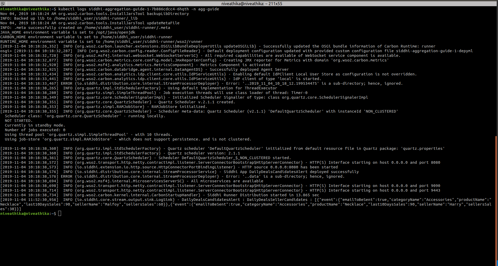

# Work in progress

## Deployment

### Deploy on Kubernetes

1. It is advisable to create a namespace in Kubernetes to follow below steps.

    ````console
    kubectl create ns agg-guide
    ````

2. There are some prerequisites that you should meet to tryout below SiddhiProcess. Such as configure MySQL database in Kubernetes. First, configure the MySQL server within the created namespace as in Step 1. You can use the official [helm chart](https://github.com/helm/charts/tree/master/stable/mysql) provided for MySQL.

    * First, install the MySQL helm chart as shown below,

        ````console
        helm install --name mysql-server --namespace=agg-guide --set mysqlRootPassword=root,mysqlUser=root,mysqlDatabase=testdb stable/mysql
        ````

        Here, you can define the root password to connect to the MYSQL database and also define the database name. BTW, make sure to do `helm init --tiller-namespace=agg-guide` if it is not done yet.

        Verify pods are running with `kubectl get pods --namespace=agg-guide`

    * Then, you can set a port forwarding to the MySQL service which allows you to connect from the Host.

        ````console
            kubectl port-forward svc/mysql-server 13300:3306 --namespace=agg-guide
        ````

    * Then, you can login to the MySQL server from your host machine as shown below.

        [](images/k8s-mysql-db-info.png)

3. Afterwards, you can install Siddhi Operator

    * To install the Siddhi Kubernetes operator run the following commands.

        ````console
        kubectl apply -f https://github.com/siddhi-io/siddhi-operator/releases/download/v0.2.0/00-prereqs.yaml  --namespace=agg-guide
        kubectl apply -f https://github.com/siddhi-io/siddhi-operator/releases/download/v0.2.0/01-siddhi-operator.yaml --namespace=agg-guide
        ````

    * You can verify the installation by making sure the following deployments are running in your Kubernetes cluster.

        [](images/k8s-pods.png)

        [](images/k8s-svc.png)

4. Enable [ingress](https://kubernetes.github.io/ingress-nginx/deploy/)
   * [Mandatory Commands for all clusters]

        ```console
        kubectl apply -f https://raw.githubusercontent.com/kubernetes/ingress-nginx/master/deploy/static/mandatory.yaml
        ```

   * Docker for Mac/Docker for Windows

        ```console
        kubectl apply -f https://raw.githubusercontent.com/kubernetes/ingress-nginx/master/deploy/static/provider/cloud-generic.yaml
        ```

   * Minikube

        ```console
        minikube addons enable ingress
        ```

   * GKE

        ```console
        kubectl apply -f https://raw.githubusercontent.com/kubernetes/ingress-nginx/master/deploy/static/provider/cloud-generic.yaml
        ```

5. Siddhi applications can be deployed on Kubernetes using the Siddhi operator.

    * To deploy the above created Siddhi app, we have to create custom resource object yaml file (with the kind as SiddhiProcess).

    * Kubernetes CRD can be exported from the Siddhi [tooling](https://siddhi.io/en/v5.0/docs/tooling/) runtime with the editor UI in [http://localhost:9390/editor](http://localhost:9390/editor)
  
    * Select the Export -> For Kubernetes Option

    * Steps 1- 5 is the same for both artifacts.

    * In Step 6, push the docker image with different name to Docker deployment.

        !!! info
            This docker image will be different to the one pushed in Docker deployment, since only base image with additional bundles will be push to the docker in Kubernetes deployment.

        !!! info
            Ensure that the pushed docker image is public

    * Step 7 : Let's create non-distributed and stateless deployment
        [](images/step7.png)

    * Extract siddhi-kubernetes.zip

    * Now,  let’s create the above resource in the Kubernetes  cluster with below command.

        ````console
        kubectl --namespace=agg-guide apply -f <absolute-path>/siddhi-kubernetes/siddhi-process.yaml
        ````

        Once, siddhi apps are successfully deployed. You can verify its health with below Kubernetes commands

        [](images/k8s-pods-with-siddhi.png)

    * Configure Kubernetes cluster IP as “siddhi” hostname in your /etc/hosts file.
      * Minikube: add minikube IP to the “/etc/hosts” file as host “siddhi”, Run “minikube ip” command in terminal to get the minikube IP.
      * Docker for Mac: use 0.0.0.0 to the /etc/hosts file as host “siddhi”.
      * Docker for Windows: use IP that resolves to host.docker.internal in the /etc/hosts file as host “siddhi”.
      * GKE: Obtain the external IP (EXTERNAL-IP) of the Ingress resources by listing down the Kubernetes Ingresses.

    * You can use the sample mock data generator to add data for past 5 days sales. Download the [mock data generator](https://github.com/niveathika/siddhi-mock-data-generator/releases/download/v2.0.0/siddhi-mock-data-generator-2.0.0.jar). Execute the below command to run the mock data generator.

        ```console
        java -jar siddhi-mock-data-generator-2.0.0.jar siddhi/siddhi-aggregation-guide-0/8080
        ```

        !!!note "Hostname of the HTTP Source"
        Here the hostname will include deployment name along with the port with syntax, `<IP>/<DEPLOYMENT_NAME>/<PORT>`.
        The above sample is for artifacts generated with process name, `siddhi-aggregation-guide` in Step 6 of the Export Dialog.

    * Invoke the dailyDealsAlert service with the following cURL request. You can set `emailToBeSent` as false to not send an email but only to observe the logs.

        ```console
        curl -X POST \
        http://siddhi/siddhi-aggregation-guide-1/8080/dailyDealsAlert \
        -k \
        -H 'Content-Type: application/json' \
        -d '{
            "emailToBeSent": true
        }'
        ```

        !!!note "Hostname of the HTTP Source"
        Here the hostname will include deployment name along with the port with syntax, `<IP>/<DEPLOYMENT_NAME>/<PORT>`.
        The above sample is for artifacts generated with process name, `siddhi-aggregation-guide` in Step 6 of the Export Dialog.

    * You can see the output log in the console. Here, you will be able to see the alert log printed as shown below.

        [](images/k8s-console-output.png)

        !!! info "Refer [here](https://siddhi.io/en/v5.1/docs/siddhi-as-a-kubernetes-microservice/) to get more details about running Siddhi on Kubernetes."
